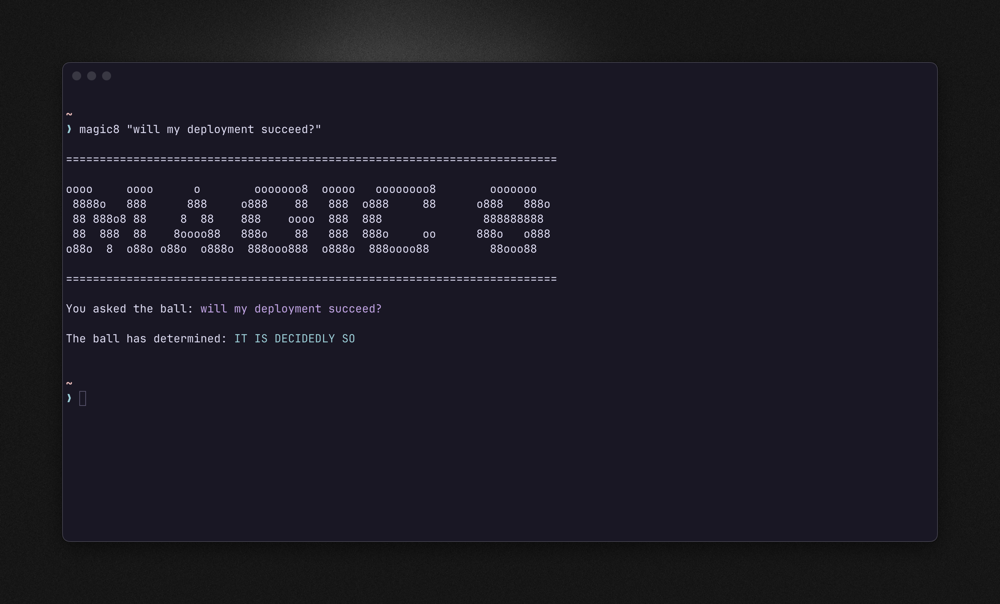

# magic8

magic8 is a fun commandline utility to summon an answer from the beyond - ask your question and receive one of 21 possible answers!
Impress, wow, and delight your friends by divining the answer to their every yes or no question! 


_No factual or realistic answers provided, do not base your life or anything serious on the output from this program. Program sold at promotional and rest-of-the-time price of £0.00. While stocks last. Terms and conditions apply*_

_*No actual terms and conditions apply_



## Installation

```bash
cargo install --git https://github.com/andybzn/magic-8-ball --bin magic8
```

## Usage

Ask the ball a question, and an answer will be returned. 

```bash
# Ask the ball a question
magic8 "your question goes here"

# Return just the answer text
magic8 -a "your question goes here"
magic8 --answer-only "will I order pizza tonight?"

# Return the question and answer as a json object
magic8 -j "your question goes here"
magic8 --json "or will I order chinese takeout?"
```

If a question is asked with no arguments, the returned answer will be color coded (colors use the terminal color palette) based on the tone of the answer:

- Green -> good news
- Yellow -> non-committal
- Red -> bad juju

## Contributing

This project is **not currently accepting contributions**.

## License
magic8 is [MIT](https://choosealicense.com/licenses/mit/) licensed